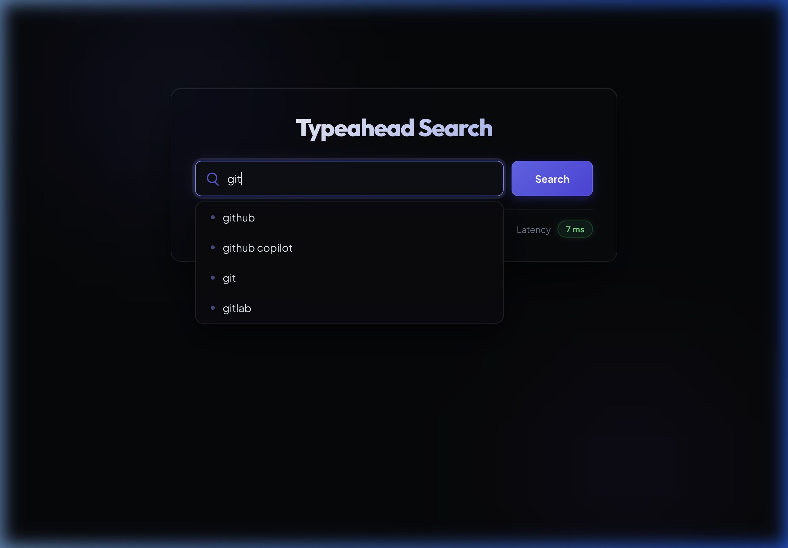

# Distributed Typeahead

A high-performance typeahead search system built with a Python (FastAPI) backend and a React frontend. The backend stores query rankings in sharded in-memory stores, distributes keys with consistent hashing, and serves prefix suggestions from a separate cache tier.

## Screenshots

### Suggestions and latency



### Search confirmation


## Requirements

- Python 3.10 or newer
- pandas (`python -m pip install pandas`)
- Node.js 18 or newer and npm

## Dataset Setup

The dataset files are intentionally excluded from Git because of their size.

1. Download the AOL User Session Collection dataset from Kaggle:
   [AOL User Session Collection 500K](https://www.kaggle.com/datasets/dineshydv/aol-user-session-collection-500k)
2. Extract the download.
3. Copy `user-ct-test-collection-02.txt` into the repository's `dataset/`
   directory.
4. Install pandas and generate the aggregated query counts:

```bash
python -m pip install pandas
python dataset/aggregate.py
```

The script creates:

```text
dataset/query_counts.csv
```

The backend requires this generated file at startup. You can override its path
with the `TYPEAHEAD_DATASET_PATH` environment variable.

## Build And Run

Run all commands from the repository root.

### 1. Start the Python backend

Install the dependencies:

```bash
pip install -r backend/requirements.txt
```

Start the backend server:

```bash
python -m backend.main
```

The API starts at `http://localhost:18080`.

To run with a dataset stored elsewhere:

```bash
TYPEAHEAD_DATASET_PATH=/absolute/path/to/query_counts.csv python -m backend.main
```

To run with the consistent hashing shard scaling demonstration:

```bash
TYPEAHEAD_SCALING_DEMO=1 python -m backend.main
```

### 3. Install and start the frontend

In a second terminal:

```bash
cd frontend
npm install
npm run dev
```

Open `http://localhost:5173`.

The Vite development server proxies `/api` requests to
`http://localhost:18080`. To use a different backend:

```bash
VITE_BACKEND_URL=http://localhost:18080 npm run dev
```

### Production frontend build

```bash
cd frontend
npm install
VITE_API_BASE_URL=http://localhost:18080 npm run build
```

The static frontend output is written to `frontend/dist/`.

## API Documentation

### Get suggestions

```http
GET /suggest?q=<prefix>
```

Returns up to 10 ranked suggestions for a normalized prefix.

Example:

```bash
curl "http://localhost:18080/suggest?q=goo"
```

Success response:

```json
{
  "prefix": "goo",
  "suggestions": [
    "google",
    "google maps"
  ]
}
```

An empty or unknown prefix returns `200 OK` with an empty `suggestions` array.

### Record a search

```http
POST /search
Content-Type: application/json
```

Request body:

```json
{
  "query": "google"
}
```

Example:

```bash
curl -X POST "http://localhost:18080/search" \
  -H "Content-Type: application/json" \
  -d '{"query":"google"}'
```

Success response:

```json
{
  "status": "success"
}
```

Invalid JSON, a missing `query`, a non-string `query`, or an empty query returns
`400 Bad Request`:

```json
{
  "status": "error",
  "message": "query must not be empty"
}
```

## Project Structure

```text
backend/          Python FastAPI web API and sharded typeahead implementation
dataset/          Dataset aggregation script and local query count data
frontend/         React and Vite user interface
docs/screenshots/ UI screenshots used by this README
```

## Implementation Notes

- Query and cache shards use separate consistent hash rings with virtual nodes.
- Suggestions are served from the cache path without reading the query store.
- Search events update ranking state and publish to the cache after crossing the
  configured score threshold.
- The frontend debounces suggestions by 300 ms and reports client-observed API
  latency.
